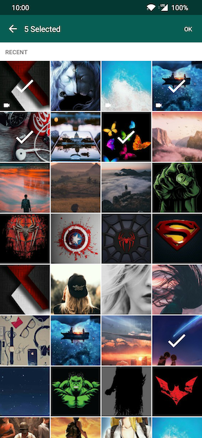

# Pix   (WhatsApp Style Image Picker)

Pix is a Whatsapp image picker replica. with this you can integrate a image picker just like whatsapp.


[](https://app.codacy.com/app/akshay2211/PixImagePicker?utm_source=github.com&utm_medium=referral&utm_content=akshay2211/PixImagePicker&utm_campaign=Badge_Grade_Dashboard)
[](https://android-arsenal.com/details/1/6935)
[](https://jitpack.io/#akshay2211/PixImagePicker)
[](https://android-arsenal.com/api?level=16)
[](https://android.libhunt.com/piximagepicker-alternatives)
## Demo





## Usage
 
```groovy
   Options options = Options.init()
          .setRequestCode(100)                                                 //Request code for activity results
          .setCount(3)                                                         //Number of images to restict selection count
          .setFrontfacing(false)                                                //Front Facing camera on start
          .setImageQuality(ImageQuality.HIGH)                                  //Image Quality
          .setPreSelectedUrls(returnValue)                                     //Pre selected Image Urls
          .setScreenOrientation(Options.SCREEN_ORIENTATION_PORTRAIT)           //Orientaion
          .setPath("/pix/images");                                             //Custom Path For Image Storage
        
   Pix.start(MainActivity.this, options);
   
```
or just use
```groovy
          Pix.start(context, Options.init().setRequestCode(100));
```
for fetching only a single picture.

Use onActivityResult method to get results
```groovy
    @Override
    public void onActivityResult(int requestCode, int resultCode, Intent data) {
        super.onActivityResult(requestCode, resultCode, data);
                if (resultCode == Activity.RESULT_OK && requestCode == RequestCode) {
                    ArrayList<String> returnValue = data.getStringArrayListExtra(Pix.IMAGE_RESULTS);
            }
        }
```
## Customise
### Theme
include these items in colors.xml with custom color codes
```xml
    <resources>
        <color name="colorPrimaryPix">#075e54</color>
        <color name="colorPrimaryLightPix">#80075e54</color>
    </resources>
```

## Permission Handling
include onRequestPermissionsResult method in your Activity/Fragment for permission selection
```groovy
   @Override
   public void onRequestPermissionsResult(int requestCode, String permissions[], int[] grantResults) {
           switch (requestCode) {
               case PermUtil.REQUEST_CODE_ASK_MULTIPLE_PERMISSIONS: {
                   // If request is cancelled, the result arrays are empty.
                   if (grantResults.length > 0 && grantResults[0] == PackageManager.PERMISSION_GRANTED) {
                        Pix.start(context, Options.init().setRequestCode(100));
                    } else {
                       Toast.makeText(MainActivity.this, "Approve permissions to open Pix ImagePicker", Toast.LENGTH_LONG).show();
                   }
                   return;
               }
           }
       }
```

## Thanks to

  - [Glide]
  - [FastScroll]
  - [Header-decor]
  - [Fotoapparat]

## Download

 [  ](https://bintray.com/fxn769/android_projects/Pix/_latestVersion)  or grab via Gradle:
 
 include in app level build.gradle
 ```groovy
        repositories {
           maven { url 'https://jitpack.io' }
        }
 ```
```groovy
        implementation  'com.fxn769:pix:1.4.4'
```
or Maven:
```xml
        <dependency>
          <groupId>com.fxn769</groupId>
          <artifactId>pix</artifactId>
          <version>1.4.4</version>
          <type>pom</type>
        </dependency>
```
or ivy:
```xml
        <dependency org='com.fxn769' name='pix' rev='1.4.4'>
          <artifact name='pix' ext='pom' ></artifact>
        </dependency>
```

Snapshots of the development version are available in [Sonatype's `snapshots` repository][snap].

## Updates
[Pix](https://github.com/akshay2211/PixImagePicker) is using the new Material library with the legacy Support Library. You have to migrate to android.support to androidx in order to use com.google.android.material. 

With Android Studio 3.2 and higher, you can quickly migrate an existing project to use AndroidX by selecting *Refactor > Migrate* to AndroidX from the menu bar.

For more details kindly refer [Migrating to AndroidX](https://developer.android.com/jetpack/androidx/migrate#migrate)
 

### for Version 1.2.5 refer [here](https://github.com/akshay2211/PixImagePicker/wiki/Documendation-ver-1.2.5)

## License
Licensed under the Apache License, Version 2.0, [click here for the full license](/LICENSE).

## Author & support
This project was created by [Akshay Sharma](https://akshay2211.github.io/).

> If you appreciate my work, consider buying me a cup of :coffee: to keep me recharged :metal: by [PayPal](https://www.paypal.me/akshay2211)

> I love using my work and I'm available for contract work. Freelancing helps to maintain and keep [my open source projects](https://github.com/akshay2211/) up to date!

   [Glide]: <https://github.com/bumptech/glide>
   [FastScroll]: <https://github.com/L4Digital/FastScroll>
   [Header-decor]: <https://github.com/edubarr/header-decor>
   [Fotoapparat]: <https://github.com/RedApparat/Fotoapparat>
